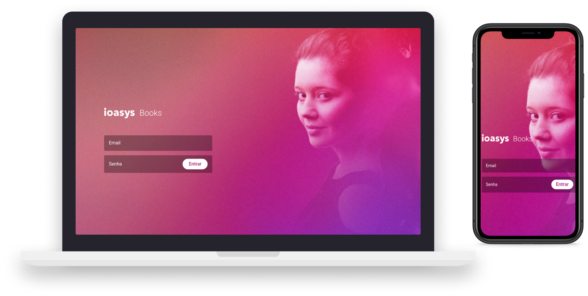

# Ioasys Books




## 👨🏻‍💻 sobre o projeto

- <p style="color: red;">Esse projeto se consiste em um desafio Front-End, desenvolvido para Ioasys </p>


## 🚀 Tecnologias

Tecnologias usadas neste projeto.

- [ReactJS](https://reactjs.org/)
- [TypeScript](https://www.typescriptlang.org/)
- [React Router DOM](https://reacttraining.com/react-router/)
- [Styled-Components](https://styled-components.com/)
- [React-Modal](https://www.npmjs.com/package/react-modal)
- [Axios](https://axios-http.com/docs/intro)
- [SWR](https://swr.vercel.app/)
- [Nookies](https://www.npmjs.com/package/nookies)
- [Convectional Commits](https://www.npmjs.com/package/git-commit-msg-linter)


## 💻 Iniciando o projeto

**Clone o projeto e acesse a pasta**

```bash
$ git clone https://github.com/msalves008/ioasys-desafio-books-frontend && cd ioasys-desafio-books-frontend
```

**Siga os passos a baixo**

```bash
# Instalando as dependências
$ yarn install


# Iniciando o projeto
$ yarn dev
```


---

Made with 💜 &nbsp;by Matheus Alves 👋 &nbsp;[See my linkedin](https://www.linkedin.com/in/msalves008)


## 👨‍💻 Criador


<table>
  <tr>
    <td align="center">
      <a href="#">
        <br>
        <sub>
          <b>Matheus Alves</b>
        </sub>
      </a>
    </td>      
  </tr>
</table>